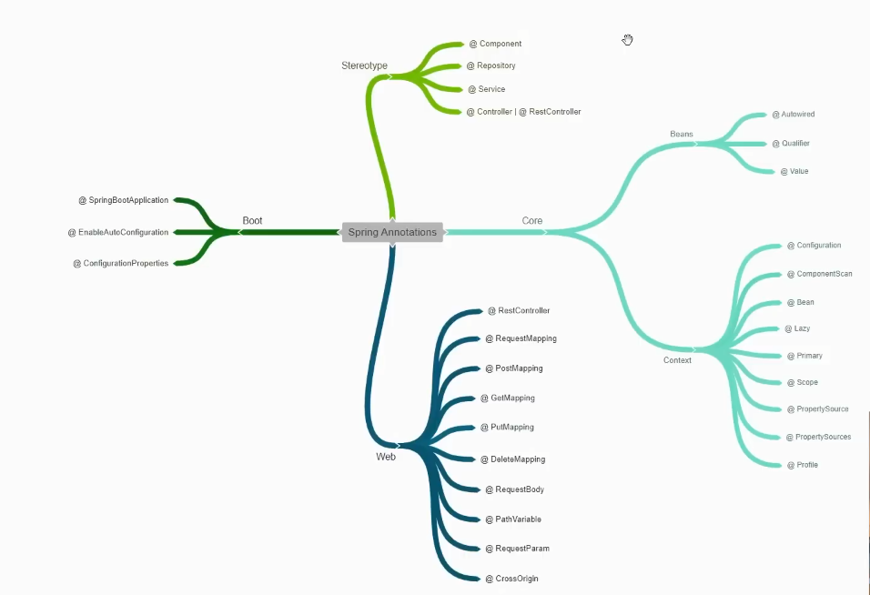
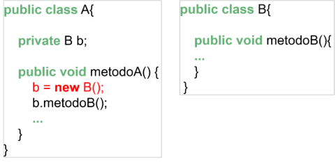
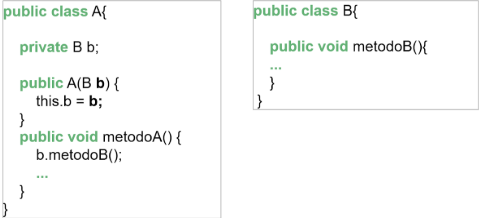
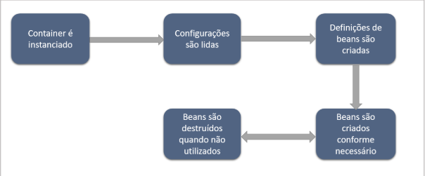
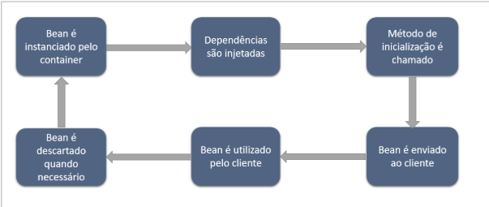
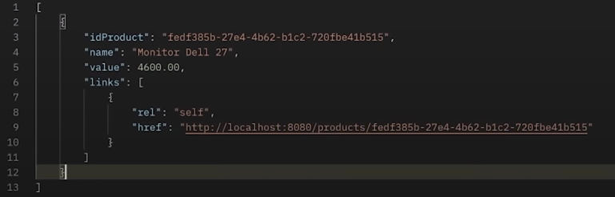
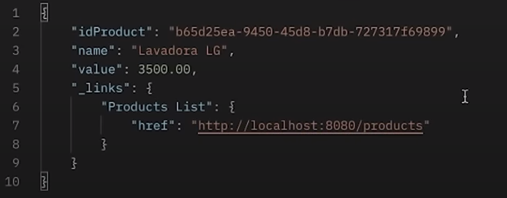

# <center>SPRING BOOT 3 - MICHELLI BRITO 

<div align="center">


</div>
<hr>

## Videos de referência para que essa documentação fosse feita 👇
- [Spring Boot Annotations | +30 anotações na prática](https://www.youtube.com/watch?v=Pd5tr483No0&ab_channel=MichelliBrito)
- [Spring Boot 3 | Curso Completo 2023](https://www.youtube.com/watch?v=wlYvA2b1BWI&ab_channel=MichelliBrito)
- PDF Spring Boot Da API REST aos Microservices – 4ª Edição, Michelli Brito.
- [Instagram Michelli](https://www.instagram.com/brito_michelli/)
- [Youtube Michelli](https://www.youtube.com/@MichelliBrito)
<hr>

## Tópicos
- [Inversão de Controle](#bom-primeiro-vamos-lembrar-sobre-inversão-de-controle)
- [Injeção de Dependência](#injeção-de-dependência)
- [Core Container](#core-container)
- [Beans](#beans)
- [Anotações Spring](#principais-anotações-spring)
- [API REST e RESTful](#api-rest-e-restful)
- [Projeto Criando API REST com SpringBoot](#criando-api-rest-com-spring-boot)
  - [Model e Mapeamento Entidade Product](#model-e-mapeamento-da-entidade-product)
  - [Inserção de Atributos](#inserção-de-atributos)
  - [Criação Repository com JPA](#criação-do-repository-com-jpa-repository)
  - [Criação Controller](#criação-do-controller)
  - [Mapeamento DTO entrada com records](#mapeamento-dto-de-entrada-com-records)
  - [POST](#post)
  - [MÉTODO POST](#método-post)
  - [MÉTODO GET](#método-get)
  - [MÉTODO GET COM ID](#método-get-com-id)
  - [MÉTODO PUT (UPDATE)](#método-put-update)
  - [MÉTODO DELETE](#método-del-delete)
  - [Inserindo HATEOAS e Criação de hipermídias](#inserindo-hateoas-e-criação-de-hipermídias)
  - [Alterações Finais dos Métodos Acima](#exemplos--alterações-dos-métodos-acima)
<hr>

### Bom, primeiro vamos lembrar sobre **Inversão de Controle**?

É um padrão de projeto, algo abstrato onde definimos todas as dependências de um determinado objeto, sem termos a necessidade de criar ou gerenciar. Nós passamos esse papel para o Spring (seu core.)

O **core** do Sring, portanto, **terá toda a responsabilidade de gerir todas as dependências**.

Exemplo: Imagine que temos duas classes, A e B.
A classe A, possui uma dependência da classe B, visto que ela utiliza um método da mesma.
Portanto, a Classe A teria que criar sempre uma instância da classe B para que assim pudesse utilizar o seu método.

<div align="center">


</div>

Mas, quando utilizamos inversão de controle, a Classe A não precisa se preocupar em criar instâncias da B. Podemos passara essa responsabilidade para o Spring, conforme dito acima.

**Ele realizará essa Inversão de Controle, através da Injeção de Dependência**.

### Injeção de Dependência

É a maneira como o Spring aplica a Inversão de Controle (definição de dependência) quando necessário.

A Injeção de Dependência define quais classes serão instanciadas e em quais lugares serão injetadas quando houver necessidade.

Portanto, a **Injeção de Dependência, nada mais é, do que a implementação concreta, da Injeção de Controle**. 😊

#### <center> Ok, mas como o Spring definirá isso?

Basta que a classe A crie um Ponto de Injeção da classe B através do construtor. E assim, quando houver necessidade o Spring usará a instância da classe B,
possibilitando que a classe A, possa utilizar o seu método b.metodoB(), conforme abaixo:

<div align="center">


</div>


Dessa forma, o Spring gerenciará todos esses **Beans**. **Beans**, são os objetos que vamos criando conforme vamos construindo nossas aplicações. E assim, o Spring vai cuidar das instancias de todos esses objetos.
<hr>

## Core Container

Quando o Spring utiliza Injeção de Dependência para aplicar a Inversão de Controle, toda essa implementação está presente no Core Container (onde fica a base de configuração do Spring Framework).

Ao executarmos a aplicação o Core Container é iniciado, as configurações da aplicação pré-definidas em classes ou arquivos XML são lidas e as dependências necessárias são definidas e criadas
através da IoC. Elas são destruídas quando não forem mais utilizadas.

Essas dependências definidas são denominadas **Beans**. Beans são objetos que possuem seu ciclo de vida gerenciado pelo container da IoC/ID do Spring.

Esses passos definem o ciclo de vida de um Container, como pode ser visto abaixo.
<div align="center">


</div>
<hr>

## Beans

Como falamos acima, Beans são objetos instanciados, montados e gerenciados por um container do Spring através da Inversão de Controle e Injeção de Dependências.

Assim como um container, um Bean também tem o seu ciclo de vida. Ele é iniciado e criado pelo container, as dependências desse Bean são injetadas,
o metodo de inicialização é chamada e então, o bean é enviado para o cliente, **no caso a classe que possui essa dependência**. Ele será utilizado e descartado.

Em suma, usando o exemplo acima, quando o container é instanciado ele cria uma instância da classe B, chama o construtor da classe A para injetar esse bean e em seguida,
a classe A utiliza esse Bean através de b.metodoB().

Após isso, esse Bean é descartado quando não mais utilizado e tal ciclo pode ser visualizado abaixo.
<div align="center">


</div>

O ciclo de vida de um bean depende do seu escopo, que pode ser determinado no Spring através da anotação @Scope. Os tipos de escopos
do Spring utilizados para web são:
- Singleton - O container irá criar uma única instância desse bean e será utilizada para todas as solicitações da instância;
- Prototype - O container irá criar várias instâncias, uma para cada solicitação;
- Request - Terá uma instância criada para cada requisição HTTP;
- Session - Terá a sua instãncia preservada e utilizada para solicitações enquanto durar a sessão.

<hr>

## Configurando Beans no Spring
É preciso que o Spring conheça quais as classes da aplicação serão beans gerenciados por ele para que então seja aplicada a IoC/ID.
Para isso há duas maneiras de configurar e determinar esses beans, utilizando configurações em arquivos XML ou por anotações.
XML hoje não são muito utilizadas, por isso utilizaremos as anotações.

Nas anotações, utilizaremos esteriótipos do Spring, definindo de forma objetiva (e específica), qual o tipo de Bean de cada classe, a saber:

## Principais Anotações Spring

<details>
<summary>VER MAIS</summary>

## <center> Stereotype
Precisamos mostrar ao Spring quais Beans (objetos), ele irá gerenciar. Um controller, Service, Repository... tudo isso é um Bean. Um objeto passa a ser Bean assim que passamos as anotações.

- @Component - Todas as classes são Component. Essa é uma anotação mais genérica;
```java
@Component
public class Product {

 private String name;
 private BigDecimal value;

 //... getters and setters
}
```
- @Repository - Classe onde terá lógicas de negócio do banco de dados (transações);
```java
@Repository
public class ProductRepository {
 // database transaction methods
}
```
- @Service - Classe de serviço, onde envolve regras e lógicas de negócio;
```java
@Service
public class ProductService {
 // business rules
}
```
- @Controller - Utilizada quando utilizamos uma aplicação que envolve camadas MVC (model view controller);
```java
@Controller
public class ProductController {
 // ... GET, POST, DELETE, UPDATE methods
}
```
- @RestController - Para API Rest. Se teremos somente endpoints, expondo a API na Web, utilizamos este.
<hr>

## <center> Core (Se divide em dois)
Tudo que envolve a base do Spring, está contida no Core, que fica dentro do projeto SpringFrameWork. Possui várias configurações prontas e também
a possibilidade de customizar e criar configurações necessárias para nossa aplicação.

### <center> 1. Beans
Agora que o Spring sabe quais classes serão Beans em virtude das anotações acima utilizadas (Esteriótipos), ele precisa saber **onde ele irá injetar essas instancias quando necessárias**.

Bom, nós utilizamos o **Objeto Service** dentro do nosso **Controller**, por exemplo. Pois assim podemos usar os métodos **findAll**, **findById**, etc.
Portanto, a classe **Controller** terá uma **dependência da classe Service**.

Precisamos **mostrar essa depência pro Spring**, para que ela saiba onde injetá-las quando necessário. Assim sendo, criaremos os **Pontos de Injeção (Dependência) de uma classe com a outra**.

```java
@Autowired
@Qualifier("parkingSpotServiceImpl")
private ParkingSpotService parkingSpotService;
```
- @AutoWired - Sempre que necessário, o Spring injetará o Bean Service, dentro do Bean Controller.

**Inicialmente, o ParkingSpotService importado acima, é uma interface contendo diversos métodos. Essa interface pode ter outras classes utilizando os seus métodos
(implementando ela). Ou seja, o Spring não consegue identificar qual Bean será injetado. Qual a solução? Usar a Anotação abaixo: @Qualifier**

- @Qualifier - Dentro dela, passamos qual Classe (que está implementando a interface/service) será utilizada.


- @Value - Algumas vezes precisamos definir algumas variáveis nas propriedades que usamos dentro do codigo. Mas ao invés
  de deixar isso fixo em um Controller, por exemplo, é uma boa práticar declarar essas propriedades dentro do arquivo properties.
  Logo, se precisarmos fazer alguma melhoria/alteração (**até mesmo sem parar a aplicação**), fica muito mais fácil. Exemplo:
```properties
app.name=Parking Control API
app.port=80
app.host=parkingcontrolapp
```

Para que isso seja exibido ao utilizarmos um método, criamos uma variável dentro da classe passando o @Value.
```java
@Value("${app.name}")
private String name;

@Value("${app.port}")
private String appPort;

@Value("${app.host}")
private String appHost;
```
Para exibir os valores, é só dar um SOUT dentro do método. [Veja aqui](https://github.com/MichelliBrito/parking-control-api/blob/8df47619b3016659e88dedb591c2f90ba25b5f4e/src/main/java/com/api/parkingcontrol/controllers/ParkingSpotController.java#L72)
<hr>

### <center> 2. Context

- @Configuration - Podemos configurar Datas de forma global, declarar Beans...
  **Sempre que o Spring iniciar a aplicação, ele irá olhar para essa classe e levará em consideração as customizações e configurações que definirmos nessa classe de Configuração.**
<hr>

- @ComponentScan - Podemos definir/excluir determinados pacotes que serão passados na anotação. Mostraremos para o Spring quais são os pacotes que ele irá fazer uma "varredura",
  buscando pelos Beans que ele irá gerenciar. **Serve só para algo customizado mesmo, pois o Spring em sí já faz uma varredura automática ao ser iniciado.**
```java
@Configuration
@ComponentScan(basePackages = "com.api.parkingcontrol")
public class BeanConfig{}
```
<hr>

- @Bean - Ao invés de declararmos pro spring usando as anotações esteriótipos, faremos de outra maneira.

  Criamos uma classe, por exemplo, chamada MyBean.

  Dentro da BeanConfig, criaremos um método que irá retornar exatamente o Objeto que criamos.
```java
@Bean
public myBean myBean() {
    return new MyBean();
}
```   
Pro Spring saber detectar que esse MyBean será um Bean gerenciado, precisamos passar @Bean.

Para podermos visualizar o que está dentro da Classe MyBean, faremos uma injeção de dependência dentro da Classe ParkingSpotController, assim como fizemos com o @Value.

Usa o Autowired para fazer a importação, e pode chamar o metodo com myBean.method(). [Veja aqui](https://github.com/MichelliBrito/parking-control-api/blob/8df47619b3016659e88dedb591c2f90ba25b5f4e/src/main/java/com/api/parkingcontrol/controllers/ParkingSpotController.java#L73C1-L74C1)

<div style="text-align: center;"> <b>Ok, isso foi um Bean criado por nós. Mas eventualmente usaremos Beans advindos de bibliotecas terceirizadas, como fazer nestes casos?</b> </div>

Dentro do nosso pom, inserimos uma dependência modelmapper, utilizada para conversões. [Veja aqui](https://github.com/MichelliBrito/parking-control-api/blob/8df47619b3016659e88dedb591c2f90ba25b5f4e/pom.xml#L38)

### Declarando Bean de uma biblioteca externa

Declaremos o Bean Modelmapper dentro da classe que iremos utilizar, mostrando que mesmo que esse Bean não tenha sido criado por nós, o Spring irá também gerenciá-lo.

```java
(dentro da classe config)
@Bean
public ModelMapper modelMapper() {
    return new ModelPapper();
}
```
E dentro da controller, que é onde iremos iniciar, faremos a injeção. [Veja aqui](https://github.com/MichelliBrito/parking-control-api/blob/8df47619b3016659e88dedb591c2f90ba25b5f4e/src/main/java/com/api/parkingcontrol/services/impl/ParkingSpotServiceImpl.java#L29)
<hr>

- @Lazy - Quando a gente não define nada na classe criada (passa somente @Component), o Spring internamente usa a "criação ansiosa". Já criando estes Beans, os deixando disponíveis para uso.

Mas podemos fazer um "start preguiçoso". **Ou seja, falar pro Spring criar esse Bean somente quando precisar**.

Passamos a anotação @Lazy e será feito dessa maneira.

E como acionar esse Bean em um momento específico pro Spring criar?

Bom, mesmo de sempre. Faremos a injeção de dependência no controller com @Autowired importanto o Bean e assim o Spring carregará o método com @Lazy. [Veja aqui](https://github.com/MichelliBrito/parking-control-api/blob/8df47619b3016659e88dedb591c2f90ba25b5f4e/src/main/java/com/api/parkingcontrol/controllers/ParkingSpotController.java#L46)

**Caso esse LazyBean não esteja importado dentro de algum método, não será inicializado pois o Spring não encontrará nenhum ponto de injeção de dependência.**
<hr>

- @Primary - Como é possivel ver no repositório desse projeto nos links acima. Nós temos uma interface chamada **ParkingSpotService**. Essa interface está sofrendo duas importações (ParkingSpotServiceImpl e ParkingSpotServiceImplV2).

Se você não especificar qual dessas o Spring irá considerar nos pontos de injeção que vamos criando, ele entrará em conflito. Precisamos declarar qual ele irá utilizar. Tipo quando passamos o arquivo no @Qualifier.

Então esse @Qualifier não irá existir. **Usaremos, portanto, o @Primary**. [Veja aqui](https://github.com/MichelliBrito/parking-control-api/blob/8df47619b3016659e88dedb591c2f90ba25b5f4e/src/main/java/com/api/parkingcontrol/services/impl/ParkingSpotServiceImpl.java#L18)

<hr>

- @Scope - Utilizaremos o Controller novamente e, nela, passaremos o @Scope.
Utilizaremos o parâmetro singleton, conforme vimos na parte de [Beans](#beans).
Em suma, o @Scope define como o Spring irá lidar com as criações dos Beans (dependendo do parâmetro).
<hr>

- @PropertySource - E se quisermos criar outro arquivo .properties com configurações customizadas?
Cabe destacar que o Sring lê a application.properties por default.

Podemos criar no package Resources um "custom.properties, por exemplo, contendo o que desejarmos.
No controller, criaremos uma várivel do tipo de conteúdo que criamos no arquivo "properties". Se for uma String, criaremos uma variável tipo String usando Anottation @Value. [Veja aqui](https://github.com/MichelliBrito/parking-control-api/blob/8df47619b3016659e88dedb591c2f90ba25b5f4e/src/main/java/com/api/parkingcontrol/controllers/ParkingSpotController.java#L61)

Mas isso não é o suficiente. O Spring precisa saber o arquivo pro Spring.
Passamos a anotação @PropertSoruce("classpath:custom.properties") [Veja aqui](https://github.com/MichelliBrito/parking-control-api/blob/8df47619b3016659e88dedb591c2f90ba25b5f4e/src/main/java/com/api/parkingcontrol/controllers/ParkingSpotController.java#L35)

- @PropertySources - Se for multiplos arquivos de .properties, usa ele para declarar todos os caminhos desejados.
<hr>

- @Profile - Imagine que temos um método que retorne a mesma coisa (objeto, por exemplo), porém com métodos diferentes e os dois estão com anotação @Bean.

Nessa situação, passaremos o @Profile dizendo qual será qual. Porém essa forma não é a ideal, ao inciarmos a aplicação teremos um conflito. O Spring não consegue saber qual perfil está ativo.

#### Jeitos de realizar
1. Na nossa application.properties, colocaremos logo no começo: ```spring.profiles.active=dev``` ou =prod (o que tiver no @Profile).


2. Ao invés de usarmos a anotação dentro no método dentro da BeanConfig, criaremos uma classe para cada Profile.
E assim sendo, declararemos o @Profile na classe em sí. [Veja aqui](https://github.com/MichelliBrito/parking-control-api/blob/8df47619b3016659e88dedb591c2f90ba25b5f4e/src/main/java/com/api/parkingcontrol/configs/DevBeanConfig.java#L9)
Na .properties mantém o que a gente quer passar no profile.active. O que muda mesmo é onde declaramos o @Profile.
<hr>

### Web
**Todas as Anottations web ficam no Controller** (EndPoints).

- @RestController - Usado para serviço RESTful = @Controller + @ResponseBody.


- @RequestMapping - Definimos qual a URI que o cliente irá enviar para acessar todos os métodos desse EndPoint.
Primeiro passamos só inicio dela, depois nos outros metodos abaixo passaremos o resto. [Veja aqui](https://github.com/MichelliBrito/parking-control-api/blob/8df47619b3016659e88dedb591c2f90ba25b5f4e/src/main/java/com/api/parkingcontrol/controllers/ParkingSpotController.java#L33)
```
Derivam do RequestMapping. Receberam uma função POST, GET, PUT ou DEL do tipo HTTP.

@PostMapping
@GetMapping - 
@PutMapping
@DeleteMapping
```

- @RequestBody - Ele vai desserializar de JSON para Objeto Java. [Veja aqui](https://github.com/MichelliBrito/parking-control-api/blob/8df47619b3016659e88dedb591c2f90ba25b5f4e/src/main/java/com/api/parkingcontrol/controllers/ParkingSpotController.java#L92)


- @PathVariable - No @GetMapping, por exemplo, nós passamos um caminho ```"/{id}"```. O PathVariable consegue recuperar essa parte da URI.
Basta passarmos nele ```(value = "id")```. [Veja aqui](https://github.com/MichelliBrito/parking-control-api/blob/8df47619b3016659e88dedb591c2f90ba25b5f4e/src/main/java/com/api/parkingcontrol/controllers/ParkingSpotController.java#L83)


- @RequestParam - Parecido com o PathVariable, dependendo do parâmetro, podemos colocar depois do primeiro parâmetro, um required = true/false. Para ser obrigatório ou não. [Veja aqui](https://github.com/MichelliBrito/parking-control-api/blob/8df47619b3016659e88dedb591c2f90ba25b5f4e/src/main/java/com/api/parkingcontrol/controllers/ParkingSpotController.java#L133)


- @CrossOrigin - É onde habilitamos o cors. É onde determinamos as origens/domínios que irão acessar a nossa API. Se colocar "*" será all.
maxAge = tempo máximo de resposta. [Veja aqui](https://github.com/MichelliBrito/parking-control-api/blob/8df47619b3016659e88dedb591c2f90ba25b5f4e/src/main/java/com/api/parkingcontrol/controllers/ParkingSpotController.java#L32)
Pode ser feito a nível de: classe, método e também configurações globais da aplicação.
<hr>

### Boot

- @SpringBootApplication - A classe void main irá conter essa anotação inicial. Serve para darmos o "start".
Além disso essa anotação é uma combinação de 03 outras anotações:
  1. ComponentScan - Falamos pro Spring onde será os pacotes que ele irá fazer a varredura e os Beans que ele irá gerenciar;
  2. @Configuration - Mostra que é um Bean de configuração do Spring;
  3. @EnableAutoConfiguration - Veja abaixo 👇


- @EnableAutoConfiguration - Utilizada para dizer ao Spring para ele utilizar de forma automática as suas configurações. (Tomcat, MVC, Config de registro de beans, etc...).


- @ConfigurationProperties - Lembra do @Value que passamos no Controller? Tivemos que criar variavéis para acessar esses valores que foram passados na .properties.

Nós podemos, portanto, passar esses dados do .properties para um DTO. **Ou seja, converteremos de propriedade para objeto java.**
1. Criamos uma classe para isso, chamada AppProperties [Veja aqui](https://github.com/MichelliBrito/parking-control-api/blob/8df47619b3016659e88dedb591c2f90ba25b5f4e/src/main/java/com/api/parkingcontrol/AppProperties.java#L8);
2. A anotação já vem com um parâmetro chamado "prefix = app". Isso seria um prefixo comum entre as propriedades do arquivo .properties;
   3. Criamos os métodos que iremos utilizar. Se dentro da .properties temos app.name, app.port, app.host, criaremos as variáveis;
      ```java
         private String name;
         private String port;
         private String host;
      
        //criar também os getters e setters.
      ```
   E então, dentro da classe Controller, podemos fazer o SOUT usando essa ponto de injeção. [Veja aqui](https://github.com/MichelliBrito/parking-control-api/blob/8df47619b3016659e88dedb591c2f90ba25b5f4e/src/main/java/com/api/parkingcontrol/controllers/ParkingSpotController.java#L74)
</details>


<hr>

## API REST e RESTful

É uma aplicação cliente/servidor que envia e recebe dados por protocolo HTTP. Utiliza XML e JSON como padrão de comunicação e também pode ser
implementada na linguagem desejada.

O objetivo de desenvolver uma API é para permitir a interoperabilidade entre aplicações. Ou seja, que os dados fluam entre diversos sistemas com o mínimo de intervenção
humana possível. A mesma API pode, portanto, ser utilizada em um disposito “desktop” e mobile simultaneamente.

Uma API só é RESTful quando se usa na sua implementação o conceito arquiterual REST. Em suma, **REST é algo abstrato** enquanto **RESTful é algo mais concreto**, como a
implementação deste modelo em alguma API.

### <center> Arquitetura REST
Uma arquitetura REST é em resumo um conjunto de boas práticas. Existem 6 constraints obrigatórias para uma API ser considerada REST.
1. Ela deve ser cliente/servidor, separando responsabilidades;
2. Stateless - Não guardar estado no servidor;
3. A aplicação deve ter a capacidade de realizar cache para reduzir trafégo de dados entre cliente/servidor;
4. Deve ter uma interface uniforme, contendo recursos bem definidos, apresentar hipermídias e utilizar corretamente métodos HTTP e códigos de retorno;
5. O sistema deve ser construído em camadas, tendo a possibilidade de escalar a aplicação em multiplos seridores;
6. a aplicação deve ter a capacidade de evoluir sem a quebra da mesma, ou seja, código sob demanda.
<hr>


## Spring Boot

É como se fosse uma somatória do Spring FrameWork + Servidor embutido (Tomcat ou Netty) - XML <bean> Configuration ou @Configuration

Antigamente precisava criar vários arquivos XML pra definir algumas coisas, onde hoje tudo já vem configurado, automatizado e simplificado.
<hr>

## Criando API REST com Spring Boot
### Overview do projeto

**PRODUTS API REStful - Products.**

### Model e Mapeamento da Entidade Product.
1. Criaremos um package model e uma classe ProductModel;
2. Passamos @Entity para ela se tornar uma entidade;
3. @Table(name = "TB_PRODUCTS");
4. Implementamos Serializable, passando private static final long serialVersionUID = 1L.

### Inserção de atributos
Algumas coisas aqui estarão diferentes do curso do Nélio, uma vez que este curso é um pouco mais atualizado.
Por exemplo:
1. o passar o GenerationType do Id, usaremos AUTO;
2. O Id não será integer e sim UUID;
   - UUID é indicado para projetos que usam banco de dados, evita conflitos de termos ID semelhantes.
3. O value agora será BigDecimal.
```java
@Entity
@Table(name = "TB_PRODUCTS")
public class ProductModel implements Serializable {
    private static final long serialVersionUID = 1L;
    @Id
    @GeneratedValue(strategy = GenerationType.AUTO)
    private UUID idProduct;
    private String name;
    private BigDecimal value;
}
```
E agora, geramos nosso construtor e getters and setters. 😊
Rodando o código Spring, dentro do pgAdmin 4 (postgres), a tabela terá sido inserida.


### Criação do Repository com JPA Repository
Contaremos com diversos métodos prontos sem precisar implementar cada um deles.
Seja para salvar recursos, obter uma lista de recursos um determinado recurso pelo ID, enfim... fazer tudo com JPA com facilidade!

1. Criaremos um novo pacote **repositories** com uma interface chamada ProductRepository;
2. Como sabemos, extendemos JpaRepository<**Entidade**, **Identificador**>;
3. Passamos a anotação, pois precisamos mostrar pro spring que tal classe será um bean gerenciado por ele;
   - Neste, caso: @Repository.
```java
@Repository
public interface ProductRepository extends JpaRepository<ProductModel, UUID> {}
```

### Criação do Controller

1. Criaremos um **ponto de injeção**, visto que que Controller é dependente de Repository.
   - Para isso, utilizaremos o @Autowired, importando o ProductRepository.
2. Implementaremos agora os métodos CRUD.

<hr>

### POST
O POST receberá o recurso, irá fazer uma validação inicial e salvar na base de dados.
Antes disso, para recebermos esses valores via JSON, precisaremos mapear esses campos.

Para isso, usaremos uma feature: **records**. Eles nos permitem iniciar esses objetos para transferência de dados, como os DTOS por exemplo.
Criaremos portanto, um DTO, ele:
1. Irá receber dados desse recurso "Product";
2. Fará a validação inicial;
3. Se tudo estiver OK, ele fará a conversão para o model e salva este recurso na base de dados.
<hr>

### Mapeamento DTO de entrada com records
1. Criamos o pacote dtos;
2. Criamos um Record DTO, denominado ProductRecordDto;
3. Passaremos os parâmetros do Product, menos ID pois não precisamos nos preocupar.
```java
public record ProductRecordDto(String name, BigDecimal Value){}
```
Destacando-se que o Record já possui métodos prontos, como: getters/constructores/equals&hashcode etc.

Records além disso, são **IMUTÁVEIS**, por isso, não possuem métodos **SETTERS**.

**Para validarmos, dentro do parâmetro passaremos algumas anotações, como:**
```java
public record ProductRecordDto(@NotBlank String name, @NotNull BigDecimal value) {}
```

<hr>

### MÉTODO POST

```java
@PostMapping("/products")
public ResponseEntity<ProductModel> saveProduct(@RequestBody @Valid ProductRecordDto productRecordDto) {
    var productModel = new ProductModel();
    BeanUtils.copyProperties(productRecordDto, productModel);
    return ResponseEntity.status(HttpStatus.CREATED).body(productRepository.save(productModel));
}
```
ResponseEntity - Retorno do método, neste caso do ProductModel, que na linha abaixo, será criado.

O método saveProduct vai receber como parâmetro (corpo da solicitação Http) um ProductRecordDto que conté um name e um value.

@RequestBody - Ajuda a deixar a aplicação no padrão REST, pois, sem ela, se mapeamos algum endereço, o Spring entende que é algo que está dentro da nossa aplicação, como um arquivo, por exemplo. O @ResponseBody vai entender que esse é um endereço de uma página da web, obedecendo ao princípio do REST de comunicação via protocolo HTTP.

@Valid - Para que esses dados entrem de fato em vigor

Dentro da função iniciamos um ProductModel. O Dto serve somente para receber o que está vindo na requisição do corpo em formato JSON.

Por isso na linha abaixo, usamos o BeanUtils.copyProperties para fazer a conversão de JSON para Model.

Nessa ultima linha, construimos o retorno. O retorno do tipo ResponseEntity será em duas partes:
1. Status - Se tudo ocorreu bem, precisamos enviar para o cliente que o recurso foi criado. Usamos portanto: HttpStatus.CREATED
2. Já no .body (corpo) dessa reposta, poderemos enviar o que foi salvo. (Nome e Valor) que o cliente colocou + o ID que será gerado.
3. E pra fazer esse save? Como pode ser observado, estamos importando o productRepository. Usaremos seu método .save dentro do body, passando nosso var productModel.
<hr>

### MÉTODO GET
```java
@GetMapping("/products")
public ResponseEntity<List<ProductModel>> getAllProducts() {
    return ResponseEntity.status(HttpStatus.OK).body(productRepository.findAll());
}
```

Como são **TODOS** os produtos, ele irá nos retornar uma **List** do tipo ProductModel.

Diferente do código post, ele irá nos retornar o HttpStatus.OK. E o método de repository é o .findAll() que nos retornará uma lista.
<hr>

### MÉTODO GET (COM ID)

```java
@GetMapping("/products/{id}")
public ResponseEntity<Object> getOneProduct(@PathVariable(value = "id") UUID id) {
    Optional<ProductModel> productO = productRepository.findById(id);
    if (productO.isEmpty()) {
        return ResponseEntity.status(HttpStatus.NOT_FOUND).body("Product not found.");
    }
    else {
        return ResponseEntity.status(HttpStatus.OK).body(productO.get());
    }
}
```

O @PathVariable nos ajuda a pegar o {id} passado no @Get.

O método nos retornará um Optional.

Instanciaremos um objeto ProductModel do tipo Optional, e entraremos no repository, usando o findById passando a ID do método como parâmetro.
Depois, é aquele if padrão. Se estiver vazio, lança a mensagem de not found. Se não estiver vazio, pega o product e passa no corpo da resposta.

<hr>

### MÉTODO PUT (UPDATE)

Put é parecido com o getOneProduct porque também precisamos passar o ID como parâmetro do que vamos atualizar.

```java
@PutMapping("/products/{id}")
public ResponseEntity<Object> updateProduct(@PathVariable(value = "id") UUID id,
                                                @RequestBody @Valid ProductRecordDto productRecordDto) {
    Optional<ProductModel> productO = productRepository.findById(id);
    if (productO.isEmpty()) {
        return ResponseEntity.status(HttpStatus.NOT_FOUND).body("Product not found.");
    }
    var productModel = productO.get();
    BeanUtils.copyProperties(productRecordDto, productModel);
    return ResponseEntity.status(HttpStatus.OK).body(productRepository.save(productModel));
}
```

Continua recebendo o PathVariable e UUID.

Mas dessa vez, receberá também o RequestBody e Valid, pois precisamos do name e value (ProductRecordDto) para realizarmos o update.

Criamos a variável productO que utilizando o repository, irá verificar se primeiro, o produto existe (buscando pela ID).

Se existir, fazemos o if para saber se está vazio.

Se não estiver vazio, instanciaremos um ProductModel. Mas esse ProductModel, não será instanciado do zero igual na saveProduct. Iremos atribuir a essa variável o valor que ja recebeu da base dados "productO".

E daí damos o retorno padrão dando o OK e salvando.
<hr>

### MÉTODO DEL (DELETE)

```java
@DeleteMapping("/products/{id}")
public ResponseEntity<Object> deleteProduct(@PathVariable(value = "id") UUID id) {
    Optional<ProductModel> productO = productRepository.findById(id);
    if (productO.isEmpty()) {
        return ResponseEntity.status(HttpStatus.NOT_FOUND).body("Product not found.");
    }
    productRepository.delete(productO.get());
    return ResponseEntity.status(HttpStatus.OK).body("Product deleted successfully.");
}
```
A partir de agora o código ja está mais autoexplicativo.

Passamos os mesmos parâmetros porém depois do if não precisamos intanciar um ProductModel.

Só passamos o delete do repository com o .get() para pegar toda a entidade.

Cabe destacar, que o repository possui outros deletes, tais como:
- deleteAll(), deleteById, etc...
<hr>

### Inserindo HATEOAS e Criação de hipermídias

Colocamos a dependência no maven.
```
<dependency>
	<groupId>org.springframework.boot</groupId>
	<artifactId>spring-boot-starter-hateoas</artifactId>
</dependency>
```

E extendemos na classe principal, tudo isso visando uma melhor **navegabilidade**.
```java
public class ProductModel extends RepresentationModel<ProductModel> implements Serializable {}
```

Agora, quando formos utilizar essa clase, internamente ele já vai ter alguns métodos (como add, por exemplo) para construimos alguns links para navegabilidade.
<hr>

### EXEMPLOS + ALTERAÇÕES DOS MÉTODOS ACIMA.

#### <center> NA CLASSE PRODUCTCONTROLLER <<<
Como é possível ver nos métodos acima, **fazemos no proprio retorno a busca ou save ou qualquer outro método do repository**, iremos mudar isso.

Import dos links e methodOn
```java
import static org.springframework.hateoas.server.mvc.WebMvcLinkBuilder.linkTo;
import static org.springframework.hateoas.server.mvc.WebMvcLinkBuilder.methodOn;
```

Exemplo de alteração:
```java
ANTES

@GetMapping("/products")
public ResponseEntity<List<ProductModel>> getAllProducts() {
    return ResponseEntity.status(HttpStatus.OK).body(productRepository.findAll());
}
```

```java
DEPOIS

@GetMapping("/products")
public ResponseEntity<List<ProductModel>> getAllProducts() {
   List<ProductModel> productsList = productRepository.findAll();
   if (!productsList.isEmpty()) {
      for (ProductModel product : productsList) {
         UUID id = product.getIdProduct();
         product.add(linkTo(methodOn(ProductController.class).getOneProduct(id)).withSelfRel());
      }
   }
   return ResponseEntity.status(HttpStatus.OK).body(productsList);
}
```

#### <center> RESUMO

- Criamos uma Lista do tipo ProductModel e passamos o findAll dentro dela;
- Fazemos um if para saber se ela está vazia, se não tiver:
  - Faremos um loop, criaremos uma variável ID e usaremos o product.add;
    - **O .add é uma extensão do proprio RepresentationModel!**
  - Dentro do add, usaremos linkTo, methodOn e withSelfRel.

#### linkTo - Fala pra qual endpoint/método vamos redirecionar o cliente quando ele clicar neste link.

#### methodOn - Qual controller está esse método? E qual é este método em sí que vai receber esse redirecionamento?

Bom, se o cliente está numa lista de produtos, vamos redirecionar ele para um produto específico, neste caso é o **getOneProduct**.

1. Primeiro definimos qual Controller está esse método (ProductController.class);
2. E depois qual o nome desse método. Usaremos o método de baixo getOneProduct;
   3. Como esse método recebe um id, passamos o id que criamos em cima. (Id de cada um dos produtos iterado pelo for).

withSelfRel - Redireciona para cada um de seus produtos em sí.



```java
ALTERAÇÃO GET ONE PRODUCT

@GetMapping("/products/{id}")
public ResponseEntity<Object> getOneProduct(@PathVariable(value = "id") UUID id) {
    Optional<ProductModel> productO = productRepository.findById(id);
    if (productO.isEmpty()) {
        return ResponseEntity.status(HttpStatus.NOT_FOUND).body("Product not found.");
    }
    productO.get().add(linkTo(methodOn(ProductController.class).getAllProducts()).withRel("Products List"));
    return ResponseEntity.status(HttpStatus.OK).body(productO.get());
}
```

Única diferença é que não referenciamos por getOne, faremos o método .getAllProducts().


<hr>

# RESUMO

Abordando aqui o necessário e o que lembrar ao criar um projeto Spring seguindo os ensinamentos API RESTful.

## Base Teórica
1. Lembrar sobre [Inversão de Controle](#bom-primeiro-vamos-lembrar-sobre-inversão-de-controle)
2. [Injeção de Dependência](#injeção-de-dependência)
3. [Ciclo de vida do Bean](#beans) (se será Singleton, Prototype, Request ou Session)
<hr>

## Prática

1. Configuração de Beans passando as anotações. Todas estão [aqui](#principais-anotações-spring)
2. Lembrar da [arquitetura rest](#center-arquitetura-rest) e suas 6 constraints obrigatórias
<hr>

## O que lembrar ao ir criando Objetos?

Lembrar de dentro da pasta .spring (dentro de java), criar os packages:
### domain
Onde ficará as entidades.

**Entidades** receberão os atributos que veremos na UML do projeto ou no
que for solicitado.
O que é interessante inserir:
1. @Entity(name="users");
2. @Table(name="users") - Se o arquivo chama User o nome da table é sempre plural;
3. @Getter & @Setter;
4. @AllArgsConstructor e se quiser noArgs também;
5. @EqualsAndHashCode(of="aqui o que queremos, id por exemplo").

Passar as anotações nos atributos.

E notar se terá alguma relação de ManyToMany, OneToOne, etc...

Se tiver que implementar algum ENUM, é só criar ele e passar com @Enumetered

#### ID
- Pode ser do tipo Long ou UUID;
- Passar @ID e o @GenerationValue (.IDENTIY ou .AUTO)

#### Outros Campos
Se quisermos que um campo específico (como CPF ou Email seja unico), passaremos
@Column(unique=true)
<hr>

### controller
Interação do client com o nosso backend.
**Para chamarmos os métodos criados.**

Aqui receberemos as requisições do cliente e passaremos adiante ao Service somente as informações
relevantes para completar a requisição.

Essa camada é o "primeiro contato" com as requisições. Enviaremos também ao cliente a resposta
(positiva ou negativa).

- Realizar apenas operações relacionadas a Request e Response (HTTP);
- Não possuir "conhecimento" sobre regras de negócios, ou acesso ao DB;
- Formada quase que exclusivamente por Middlewares.

Precisamos passar o @RequestMapping com a url onde iremos realizar as operações.

[Veja os métodos Get, Post e Delete](https://github.com/zenonxd/spring-data-jpa-2024/blob/c95c6fce7a07d3c59fd97a300b0b661a08de2364/src/main/java/com/bookstore/jpa/controller/BookController.java#L16)
<hr>

### dtos
O Dto serve somente para receber o que está vindo na requisição do corpo em formato JSON.
Em suma, é o que o cliente passará no postman, por exemplo.

O dto já possui métodos prontos getters/constructores/equals&hashcode etc.
Mas não possui Set, pois records são imutáveis.

Se atentar ainda, as anotações dentro do parâmtro, @NotBlank/@NotNull, etc.

[Para ver mais](#mapeamento-dto-de-entrada-com-records)
<hr>

### repositories
Para persistirmos (salvarmos/encontrarmos) usuário ou algo específico.

O repository conta com diversos métodos prontos para manipulação de tabelas, para não precisarmos ficar implementando.

Ele terá contato direto com o banco de dados.

Criaremos uma interface com o nome do item + repository: ProductRepository e extenderemos
com JpaRepository<Entidade, Identificador>.

Passar anotação @Repository e só.

[Exemplo de métodos pronto.](https://github.com/zenonxd/spring-data-jpa-2024/blob/c95c6fce7a07d3c59fd97a300b0b661a08de2364/src/main/java/com/bookstore/jpa/repositories/BookRepository.java#L11)
Da para passar até query SQL e procurar algo por titulo da entidade.
<hr>

### services
Regras de negócio!
**Aqui faremos validação e verificação de métodos que iniciamos no repository.**

**Terá acesso ao repository ou a outras classes do tipo Service** com autowired.

É a camada intermediária da arquitetura MSC, responsável por abstrair as regras de negócio
e controlar o acesso aos dados.

Isso deixará a camada model mais leve e objetiva. 

**Essa camada também será responsável pelo acesso aos dados, validará se as informações recebidas 
do Controller são suficientes para completar a requisição.**

- Centralizar o acesso aos dados e funções externas;
- Abstrair regras de negócios;
- Não ter nenhum "conhecimento" sobre a camada Model (EX: Query SQL);
- Não receber nada relacionada ao HTTP (Request ou Response).
<hr>

## Tratando exceções

